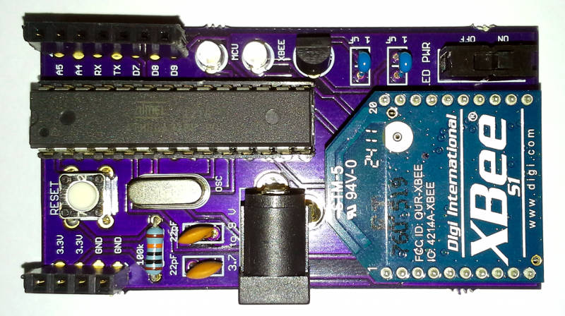
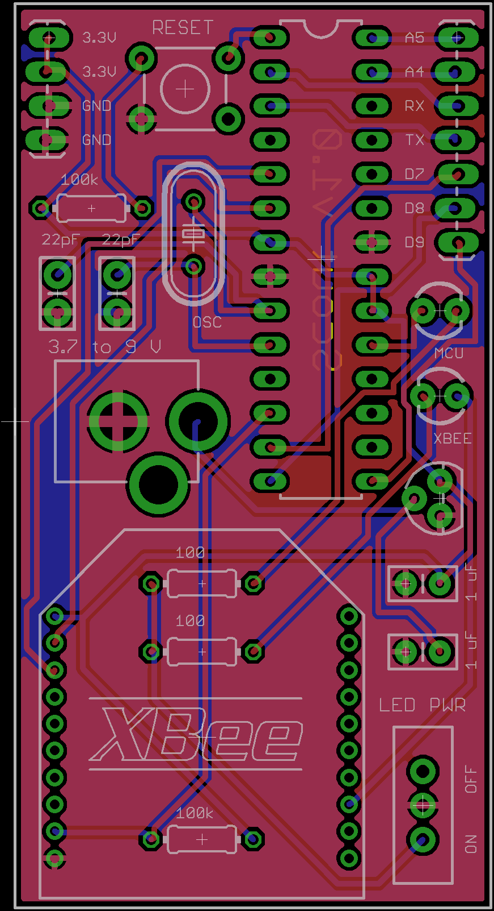

## Scout: A low-power, low-cost, wirelessly networked enviornmental sensor platform

- Arduino Uno Compatible
- 3.3 V System Voltage Regulated by Efficient Microchip MCP1702 
- 3.7-12 V Input Voltage via 5 mm (2.1 mm Center Pole) Barrel Jack
- ATmega328 Microcontroller
- XBee RF Module Ready
- Header Access to Two Analog Input Pins and Five Digital I/O Pins
- Switchable XBee and MCU Status LEDs 
- An Arduino Library Including a Scout Class to Facilitate Entry and Exit from Low-Power XBee and MCU Sleep States

**Overview**

Scout is a small-footprint (< 4 in2), XBee RF module-ready, Arduino-compatible, single-board platform designed for deploying low-power wireless sensor modules as part of a wireless sensor network. Target applications include environmental monitoring and environmental. XBee RF modules are widely used in the open-source hardware community to provide wireless serial communication between devices. These radios are relatively easy to program, well supported by Digi International, and available in a variety of power envelopes for short-range (< 30 m) and long range (> 1000 m) transmission. Moreover, a variety of XBee shields exist for the Arduino platform making these radios easy to incorporate into Arduino projects. Unlike other available XBee radio hardware, Scout is designed specifically with low-power applications in mind. 

## Core Design Parameters

The four Core Design Parameters (CDPs) around which the Scout module was developed are:

- CDP 1 -	Arduino Compatible for Rapid Development
- CDP 2 -	Low Power for Long Term (>1 month) Battery Powered Deployment
- CDP 3 -	Adaptable Physical and Wireless I/O Capabilities for Flexible Sensor and Network Configurations
- CDP 4 -	A Minimal Number of Readily Available Components to Minimize Footprint and Cost 

**CDP 3** 

XBee radios are relatively low cost, easily programmed (at least with Windows machines via the X-CTU program), and are easily integrated with MCUs via serial communication. Moreover, XBee radios come in a several varieties facilitating point-to-point, star, or mesh wireless network topologies. Moreover, the radios are available in a variety of power envelops for short range (<30 m indoors) and long range (>1000 m outdoors) transmissions. This makes the XBee devices suitable for a wide variety of uses.

**CDP 2**

XBee radios also have a low-power sleep state (<10 microA) making them suitable for devices engaged in battery-powered periodic monitoring of environmental variables.

 
**CDP 1** 

Scout is built around a ATmega328 MCU (DIP-28). The ATmega328 is programmed with the Arduino Uno boot loader and clocked via an external crystal at 16 MHz making the Scout compatible with the Arduino IDE.

**CDP 2**

The ATmega328 has several low-power states, the most miserly of which results in a current draw of only approximately 7 microA.

**CDP 3**

Moreover, the ATmega328 has plenty of analog inputs and digital I/O pins, some of which are capable of PWM. Peripherals include several timers, an analog-to-digital converter, and an analog comparator. 

**CDP 4**

The use of a through-hole variety of the ATmega328 plugged into a DIP-28 socket requires a larger footprint then if the SMD variety was employed. However, being able to remove the chip for service should it be needed allows for omitting header access to all of the chip’s pins including those used for SPI communication.

**CDP 3 and 4** 

Instead of header access to all of the ATmega328 I/O pins, Scout includes header access to two analog inputs and five digital I/O pins. Scout is designed for wireless sensor networks where each node incorporates a small number of sensors. So while the ATmega 328 has 14 general purpose I/O pins and 6 analog inputs, Scout applications are likely to require only a few such pins. For this reason, and the desire to minimize board size, header access is only give to two analog pins (Arduino A4 and A5) and five digital pins (Arduino D0, D1, D7, D8, and D9). The digital pins were specifically selected to give access to the ATmega328’s UART (D0 and D1, for programing using a product like the SparkFun FTDI Basic 3.3V USB to Serial board), the 328’s analog comparator (D7), and the 16-bit timer (D9). These are the most important peripherals for sensor implementation.  

**CDP 2 and 3** 

Several of the ATmega328’s other digital I/O pins are used to interface with the XBee radio. Arduino D3 and D4 are connected to the XBee RX and TX pins, respectively. Thus, the Arduino SoftwareSerial library is used to communicate with the XBee preserving the UART through D0 and D1 for programming of the board. Arduino D6 is connected to the XBee sleep pin to engage and disengage the XBee’s low-power sleep state. Digital pin 13 is connected to a status LED. A status LED is also connected to the XBee radio to indicate when it is on. A SPDT switch is included on the board so the status LEDs can be disabled to conserve power.

**CDP 4** 

Scout is designed using all through-hole componentsThe decision to use all through-hole components was primarily due to the desire to affordably fabricate prototypes. Certainly, many of the components could be replaced with SMDs. This might result in a significant reduction of board size, which would be desirable. On the other hand, as the platform is currently designed, the MCU must be removable to allow it to be reprogrammed with the Arduino UNO boot loader should it become corrupted. Providing header access to the pins required for SPI communication would circumvent this limitation but would also have the disadvantageous effect of increasing board size. 

**CDP 2** 

Scout uses a Microchip MCP1702 low drop-out voltage regulator, and is designed specifically for low-power wireless sensor networks. The Microchip MCP1702 regulator accepts input voltages from 2.7 to 13.2 V and outputs 3.3 V making it ideal for small battery applications including single cell lithium polymer batteries (3.7 V). Importantly, the MCP1702 is designed with battery applications in mind having an extremely low quiescent current of approximately 2 microA. The regulator is capable of supplying sustained output of 250 mA and peak output of 500 mA making it idea to power the ATmega328, a small number of sensors, and an XBee radio. 

## Current State of Development

- PCB designed (Eagle CAD files attached) and prototype boards built (OSHpark.com) and tested.
- Arduino Scout libraries have been written and being tested. This library defines a class with functions to sleep the MCU for a given period of time, sleep the XBee, and wake the XBee. 
- Theoretical calculations have been done to show that Scout can operate continuously for more than 90 days using a 2000 mAh single-cell lithium-polymer battery transmitting data every five minutes using a series 1 XBee module. Field testing confirms this batter life. 
- A shield for Scout is in development called RucksackTL that includes temperature and light sensors (TL). The RucksackTL PCB has been designed and prototype boards have been manufuactured and tested. The Scout library will be extended to make this shield easy to use.
- A data collection module called Basecamp designed to receive and log transmission from many Scouts is in development. This project is in the early stages is based on a Raspberry Pi

**To Do**

- To facilitate flashing new programs to the microcontroller, a header with the TX pin, RX pin, and a 3.3 V and ground pin could be included to facilitate ribbon cable connections to a USB to serial board like SparkFun’s FTCI Basic 3.3V. 
- To facilitate flashing new bootloaders to the microcontroller using a product like the Atmel AVRisp MKII, a header with access to the ATmega328’s SCK, MISO, MOSI, and RESET pints could be added. Such a connection would require powering the board with 5V so care would be needed to prevent damage to the XBee radio if in socket. The board’s indication LEDs would also have to be turned off since SCK is Arduino D13 and no low-impedance loads can be present on this pin when programming via SPI. 
- LED indication could be added to XBee pin 11, which shows when data transmission is occurring.
- Unused ATmega328 digital pins could be interfaced with the XBee CTS and RTS pins to facilitate flow control and allow sending data chunks in excess of 64 bytes (the size of the ATmega328 serial buffer). 
